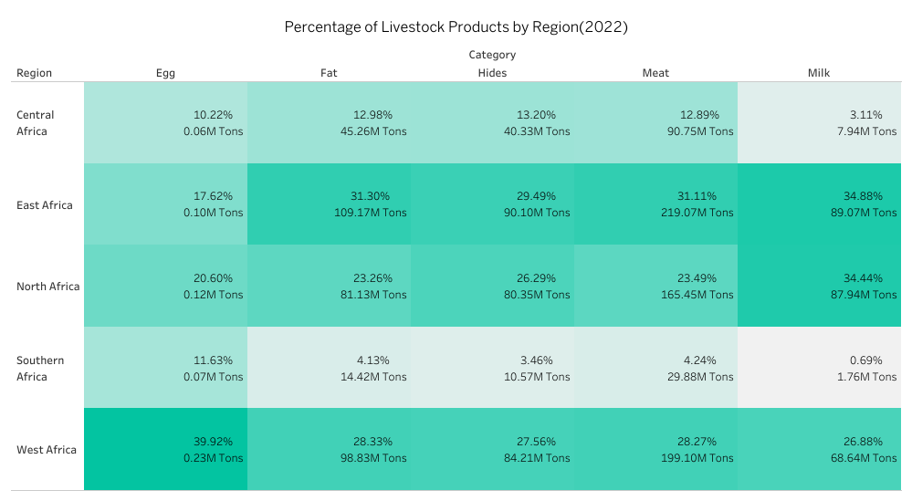
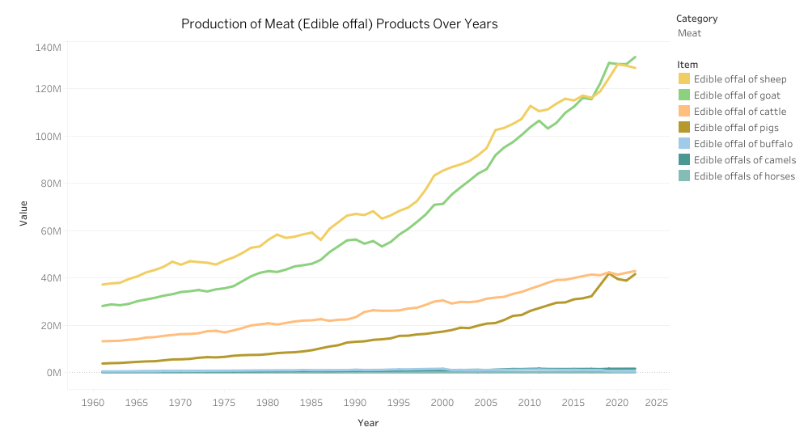

{
 "cells": [
  {
   "cell_type": "markdown",
   "id": "ed1ad379-e437-4b24-a75b-5567e074726a",
   "metadata": {},
   "source": [
    "# Regional Livestock Production Analysis in Africa\n",
    "\n",
    "## Overview\n",
    "This project explores and analyzes the trends of livestock production across different regions in Africa, focusing on key livestock products like meat, eggs, hides, milk, and fat. Using data sourced from the **Food and Agriculture Organization (FAO)**, the analysis aims to uncover insights into regional variations, production patterns, and potential areas of growth.\n",
    "\n",
    "The dataset used is restricted to African regions, and various statistical analyses, including **hypothesis testing** and **confidence intervals**, are applied to evaluate the significance of differences between regions.\n",
    "\n",
    "## Project Goals\n",
    "The main objective of this project is to:\n",
    "- Identify **regional differences** in livestock production within Africa.\n",
    "- Explore the production levels of key livestock products such as meat, eggs, hides, milk, and fat.\n",
    "- Perform **statistical analysis** to determine if certain regions dominate in livestock production.\n",
    "- Visualize the data in a way that highlights key trends and findings.\n",
    "\n",
    "## Data and Columns Used\n",
    "| Column  | Description                                      |\n",
    "|---------|--------------------------------------------------|\n",
    "| **Year**    | The year of livestock production data.(1961- 2022)            |\n",
    "| **Region**  | The African region (West Africa, East Africa, etc.).|\n",
    "| **Item**    | The type of livestock product (meat, eggs, milk, etc.). |\n",
    "| **Value**   | The quantity of production (in tons).          |\n",
    "| **Area**    | Specific country or sub-region within Africa.  |\n",
    "\n",
    "## Methodology\n",
    "- **Data Collection**: The data was obtained from the FAO Livestock Production Dataset, focusing on African regions.\n",
    "- **Data Cleaning**: Missing values and inconsistencies were addressed through data imputation and outlier handling.\n",
    "- **Exploratory Data Analysis (EDA)**: Visualizations were created to examine regional distribution and trends in production across livestock categories.\n",
    "- **Statistical Testing**: Hypothesis testing was performed to evaluate differences in production between regions.\n",
    "\n",
    "## Key Insights\n",
    "\n",
    "\n",
    "\n",
    "\n"
   ]
  },
  {
   "cell_type": "markdown",
   "id": "a0b62dca-8dc7-4a83-a577-5c18d1eeb4eb",
   "metadata": {},
   "source": [
    "### Livestock Proportion in Africa (2022)\n",
    "\n",
    "In recent years, Africa has experienced a modest increase in livestock production. In 2022, production grew by 1.1% compared to the previous year. Meat production remained the leading livestock product, reaching 704 million tonnes. This was followed by fat production at 348 million tonnes, hides at 305 million tonnes, and milk at 255 million tonnes. Egg production, though smaller in scale, amounted to 569 thousand tonnes. These figures highlight the steady growth of the livestock sector in Africa, with meat production dominating the market.\n",
    "\n",
    "\n"
   ]
  },
  {
   "cell_type": "markdown",
   "id": "74da8b4b-26d6-42b0-bcb5-be8526a6f0ce",
   "metadata": {},
   "source": [
    "## Regional Distribution of Livestock Products"
   ]
  },
  {
   "cell_type": "markdown",
   "id": "3b6582f2-6918-4c33-8638-88cb5e06d27c",
   "metadata": {},
   "source": [
    "In 2022, there was a minor decrease in egg production compared to the previous year, with a drop of 2.86%. West Africa emerged as the major producer, contributing 39.9% of Africa's total egg production, followed by North Africa (38.22%). Central Africa and Southern Africa were the least contributors, accounting for 21.85% combined.\n",
    "\n",
    "East Africa also demonstrated strong production in cattle-related products such as meat, hides, and milk. Meat production, a key livestock product in Africa, reached 704M tons (43.62%) in 2022. East Africa led with 31.1% of total meat production, followed by North Africa and West Africa, which together made up 51.76%. Southern Africa and Central Africa had lower outputs, contributing 4.24%.\n",
    "\n",
    "Hides, another significant livestock product, saw a 1.57% increase in production compared to the previous year. Eastern, West, and North Africa were the top producers, accounting for 83.34% of total hide production, while Central Africa and Southern Africa produced 13.20% and 3.34%, respectively.\n",
    "\n",
    "In terms of fat production, 346M tons were produced in 2022, with Eastern Africa leading the way at 31.3%, followed by West Africa and North Africa, contributing a combined 51.59%. Southern Africa had the lowest production at 4.13%.\n",
    "\n",
    "Milk production represented 15.82% of Africa’s total livestock output in 2022. East Africa and North Africa were the major contributors, producing 69.32% combined, followed by West Africa (26.9%) and Central Africa (3.11%)."
   ]
  },
  {
   "cell_type": "markdown",
   "id": "528cd014-ee1c-4e9f-92b4-81dd47fb861f",
   "metadata": {},
   "source": [
    "Regional Leaders:\n",
    ""
   ]
  },
  {
   "cell_type": "markdown",
   "id": "d6807d58-ed8f-4ee6-8cb1-94acca590f58",
   "metadata": {},
   "source": [
    "## Meat Production\n",
    "\n",
    "The top producers of meat in 2022 were **West Africa** and **North Africa**, with **goat** and **sheep** meat leading production. **Central** and **Southern Africa** had relatively low meat production compared to these regions.\n",
    "\n",
    "#### Meat production is divided into two categories:\n",
    "1. **Pure meat** from livestock animals.\n",
    "2. **Edible offal**, which refers to the internal organs of butchered animals, also known as organ meats.\n",
    "\n",
    "\n",
    "\n",
    "**Sheep meat**, **goat meat**, **cattle meat**, and **pig meat** have been the major contributors to meat production, making up **97.55%** of the total meat market. Over the years, sheep meat was the leading meat product, but it experienced a steady decline of about **1.1%** since 2020. In contrast, goat meat saw steady growth, topping the meat production chart in 2022 with **133 million tonnes**, followed by cattle meat at **42 million tonnes** and pig meat at **41 million tonnes**.\n",
    "\n",
    "### Edible Offal vs Pure Meat\n",
    "\n",
    "Both **pure meat** and **edible offal** have shown similar production patterns, contributing significantly to the livestock sector in Africa.\n",
    "\n",
    "\n",
    "\n",
    "### Top Meat Producers in Africa\n",
    "\n",
    "In 2022, **Nigeria** was the highest producer of meat, accounting for around **17%** of Africa's total production. Other major producers included **Ethiopia** and **Sudan** (9% each), **Chad** (5%), and **Malawi** (6%).\n",
    "\n",
    "\n",
    "\n",
    "## Fat Production\n",
    "\n",
    "**Sheep fat**, **goat fat**, **cattle fat**, **pig fat**, **buffalo fat**, and **camel fat** are the major fat products in Africa. Fat accounted for the second-largest livestock product category in Africa in 2022, with about **346 million tonnes** produced. **Goat fat** led the production with **133 million tonnes**, followed by **sheep fat** at **129 million tonnes**. **Cattle fat** production reached **42 million tonnes**, and **pig fat** contributed **41 million tonnes**. **Camel fat** accounted for **1 million tonnes**, while **buffalo fat** produced **598,000 tonnes**.\n",
    "\n",
    "\n",
    "\n",
    "### Top Fat Producers in Africa\n",
    "\n",
    "As with meat production, **Nigeria** was the leading producer of fat in 2022, accounting for **17%** of Africa's fat production. Other key producers were **Ethiopia** and **Sudan** (9% each), **Chad** (8%), and **Malawi** (6%).\n",
    "\n",
    "\n",
    "\n",
    "## Hides Production\n",
    "\n",
    "Hides production in Africa has grown steadily over the years but faced a decline in 2022, with approximately **305 million tonnes** produced. The four major sources of hides in Africa are **lamb hides**, **goat hides**, **cattle hides**, and **buffalo hides**.\n",
    "\n",
    "\n",
    "\n",
    "### Top Hides Producers in Africa\n",
    "\n",
    "In 2022, **Nigeria** was the leading producer of hides, contributing **50 million tonnes**, which accounted for **16%** of Africa's total production. Other significant producers included **Sudan** with **32 million tonnes** (**11%**), **Ethiopia** with **31 million tonnes** (**10%**), **Chad** producing **29 million tonnes** (**10%**), and **Algeria** with **21 million tonnes** (**7%**).\n",
    "\n",
    "\n",
    "\n",
    "## Milk Production\n",
    "\n",
    "Milk production has significantly contributed to livestock production in Africa. However, 2022 saw a slight decline of **0.5%** compared to the previous year, with around **255 million tonnes** produced. The primary sources of milk include **goat milk**, **sheep milk**, **cattle milk**, **camel milk**, and **buffalo milk**. Goat and sheep milk followed similar production trends over the years, accounting for **90 million tonnes** and **88 million tonnes**, respectively, contributing **70.35%** of total milk production. **Cattle milk** contributed **67 million tonnes** (**26.35%**), **camel milk** produced **7 million tonnes** (**2.87%**), and **buffalo milk** accounted for **732 thousand tonnes** (**0.29%**).\n",
    "\n",
    "\n",
    "\n",
    "### Top Milk Producers in Africa\n",
    "\n",
    "In 2022, **Sudan** was the leading milk producer, accounting for **20%** of Africa's total production. Other top producers included **Mali** with **15%**, **Algeria** at **9%**, **South Sudan** with **8%**, and **Somalia** contributing **6%**.\n",
    "\n",
    "\n",
    "\n",
    "## Egg Production\n",
    "\n",
    "Egg production contributed **0.04%** to the livestock market in 2022, with **569 thousand tonnes** produced. Egg production consists of two main types: **hen eggs** and **bird eggs**. **Hen eggs** have been the major source of egg production over the years. Despite a decline in 2019, hen egg production saw a positive increase of **1.9%** in 2022 compared to 2021, accounting for **94.7%** (539 thousand tonnes) of total egg production. **Bird eggs** made up **5.3%** (30 thousand tonnes) and have shown steady growth since 2020.\n",
    "\n",
    "\n",
    "\n",
    "### Top Egg Producers in Africa\n",
    "\n",
    "In 2022, **Nigeria** emerged as the leading producer of eggs, contributing **20%** of Africa's total egg production. Other significant producers included **Angola** and **South Africa**, each accounting for **7%** of production, followed by **Egypt** at **6%** and **Tanzania** with **5%**.\n",
    "\n",
    "\n",
    "\n",
    "## Statistical Analysis\n",
    "I carried out statistical tests, such as the **chi-square test**, to compare the regional distribution of livestock production. For regions like West Africa and East Africa, **z-tests** were applied to compare proportions of specific livestock products.\n",
    "\n",
    "\n",
    "## Global Contribution of Livestock to GDP\n",
    "\n",
    "Globally, the livestock sector, including meat, milk, hides, egg and fat production, plays a significant role in agriculture and contributes greatly to many countries' GDP. In Africa, the livestock sector is particularly important for rural livelihoods, food security, and nutrition. It contributes significantly to national economies, especially in countries like **Nigeria**, **Ethiopia**, and **Sudan**, where livestock production is a major agricultural activity.\n",
    "\n",
    "According to the **Food and Agriculture Organization (FAO)**, livestock production in Africa makes up a substantial part of the agricultural GDP, contributing between **10-15%** of the continent's total GDP, depending on the country. The sector also provides employment and supports over **350 million** people across the continent, many of whom rely on livestock for their livelihoods.\n",
    "\n",
    "---\n",
    "\n",
    "This analysis highlights not only the importance of livestock production within Africa but also its critical role in the global agricultural sector. By understanding regional production trends, stakeholders can make informed decisions to improve production efficiency, boost exports, and enhance food security across the continent.\n",
    "\n",
    "## Conclusion\n",
    "This analysis offers valuable insights into livestock production across Africa, highlighting the role of different regions in producing key livestock products like meat, eggs, and hides. It also identified growth patterns and significant regional differences in production, which can inform future agricultural policies and investments. Understanding these trends helps provide a foundation for improving livestock management, food security, and economic stability in Africa.\n"
   ]
  }
 ],
 "metadata": {
  "kernelspec": {
   "display_name": "Python 3 (ipykernel)",
   "language": "python",
   "name": "python3"
  },
  "language_info": {
   "codemirror_mode": {
    "name": "ipython",
    "version": 3
   },
   "file_extension": ".py",
   "mimetype": "text/x-python",
   "name": "python",
   "nbconvert_exporter": "python",
   "pygments_lexer": "ipython3",
   "version": "3.11.8"
  }
 },
 "nbformat": 4,
 "nbformat_minor": 5
}
